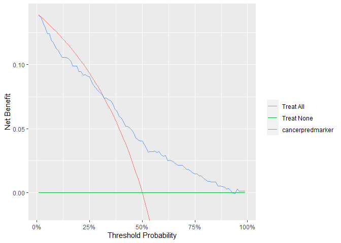
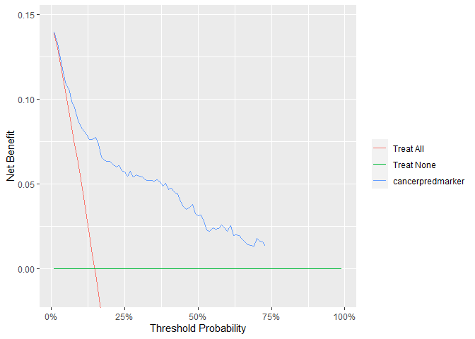

<!-- README.md is generated from README.Rmd. Please edit that file -->
<!-- badges: start -->

[](https://github.com/ddsjoberg/dca/actions)
[](https://codecov.io/gh/ddsjoberg/dca?branch=master)
<!-- badges: end -->

# Decision Curve Analysis (dca)

Diagnostic and prognostic models are typically evaluated with measures
of accuracy that do not address clinical consequences. Decision-analytic
techniques allow assessment of clinical outcomes but often require
collection of additional information and may be cumbersome to apply to
models that yield a continuous result. Decision curve analysis is a
method for evaluating and comparing prediction models that incorporates
clinical consequences, requires only the data set on which the models
are tested, and can be applied to models that have either continuous or
dichotomous results.

## Installation

You can install dca from [GitHub](https://github.com/) with:

``` r
# install.packages("devtools")
devtools::install_github("ddsjoberg/dca")
```

## Example

This is a basic example which shows you how to solve a common problem:

``` r
library(decisioncurveanalysis)

dca(cancer ~ cancerpredmarker, data = df_dca)
#> Assuming '1' is [Event] and '0' is [non-Event]
#> Printing with `autoplot(x, type = 'net_benefit', smooth = FALSE)`
```



``` r
dca(Surv(ttcancer, cancer) ~ cancerpredmarker, data = df_dca, time = 1)
#> Printing with `autoplot(x, type = 'net_benefit', smooth = FALSE)`
```


