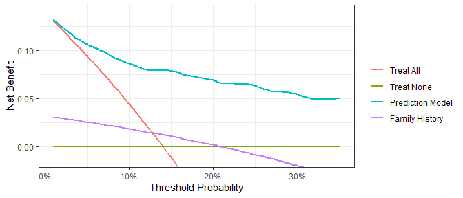
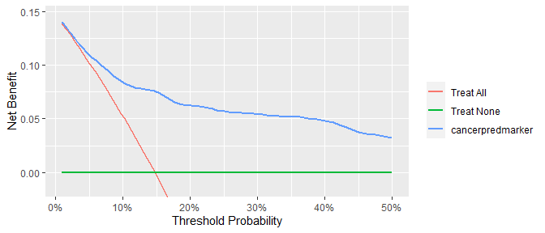

<!-- README.md is generated from README.Rmd. Please edit that file -->
<!-- badges: start -->

[](https://github.com/ddsjoberg/dcurves/actions)
[](https://codecov.io/gh/ddsjoberg/dcurves?branch=master)
[](https://cran.r-project.org/package=dcurves)
<!-- badges: end -->

# Decision Curve Analysis

Diagnostic and prognostic models are typically evaluated with measures
of accuracy that do not address clinical consequences. Decision-analytic
techniques allow assessment of clinical outcomes but often require
collection of additional information and may be cumbersome to apply to
models that yield a continuous result. Decision curve analysis is a
method for evaluating and comparing prediction models that incorporates
clinical consequences, requires only the data set on which the models
are tested, and can be applied to models that have either continuous or
dichotomous results.

The **dcurves** package includes methods for evaluating predictive
models with binary (Vickers and Elkin 2006) and time-to-event endpoints
(Vickers et al. 2008). The package also includes methods for model
evaluation in the case-control setting (Pfeiffer and Gail 2020).

## Installation

You can install dcurves from [GitHub](https://github.com/) with:

``` r
# install.packages("devtools")
devtools::install_github("ddsjoberg/dcurves")
```

## Examples

Assess models predicting binary endpoints.

``` r
library(dcurves)

dca(cancer ~ cancerpredmarker + famhistory, 
    data = df_binary,
    thresholds = seq(0, 0.35, by = 0.01),
    label = list(cancerpredmarker = "Prediction Model",
                 famhistory = "Family History")) %>%
  plot(smooth = TRUE)
```



Time-to-event or survival endpoints

``` r
dca(Surv(ttcancer, cancer) ~ cancerpredmarker, 
    data = df_surv, 
    time = 1,
    thresholds = seq(0, 0.50, by = 0.01),
    label = list(cancerpredmarker = "Prediction Model")) %>%
  plot(smooth = TRUE)
```



Create a customized DCA figure by first printing the ggplot code. Copy
and modify the ggplot code as needed.

``` r
gg_dca <-
  dca(cancer ~ cancerpredmarker, 
    data = df_binary,
    thresholds = seq(0, 0.35, by = 0.01),
    label = list(cancerpredmarker = "Prediction Model")) %>%
  plot(smooth = TRUE, show_ggplot_code = TRUE)
#> # ggplot2 code to create DCA figure -------------------------------
#> as_tibble(x) %>%
#>   dplyr::filter(!is.na(net_benefit)) %>%
#>   ggplot(aes(x = threshold, y = net_benefit, color = label)) +
#>   stat_smooth(method = "loess", se = FALSE, formula = "y ~ x", 
#>     span = 0.2) +
#>   coord_cartesian(ylim = c(-0.014, 0.14)) +
#>   scale_x_continuous(labels = scales::percent_format(accuracy = 1)) +
#>   labs(x = "Threshold Probability", y = "Net Benefit", color = "") +
#>   theme_bw()
```

## References

Pfeiffer, Ruth M, and Mitchell H Gail. (2020) “Estimating the Decision
Curve and Its Precision from Three Study Designs.” *Biometrical Journal*
62 (3): 764–76.

Vickers, Andrew J, Angel M Cronin, Elena B Elkin, and Mithat Gonen.
(2008)“Extensions to Decision Curve Analysis, a Novel Method for
Evaluating Diagnostic Tests, Prediction Models and Molecular Markers.”
*BMC Medical Informatics and Decision Making* 8 (1): 1–17.

Vickers, Andrew J, and Elena B Elkin. (2006) “Decision Curve Analysis: A
Novel Method for Evaluating Prediction Models.” *Medical Decision
Making* 26 (6): 565–74.
